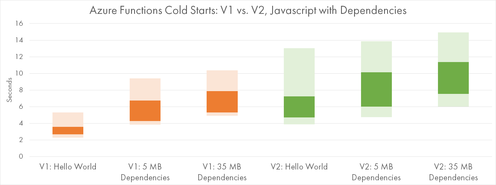
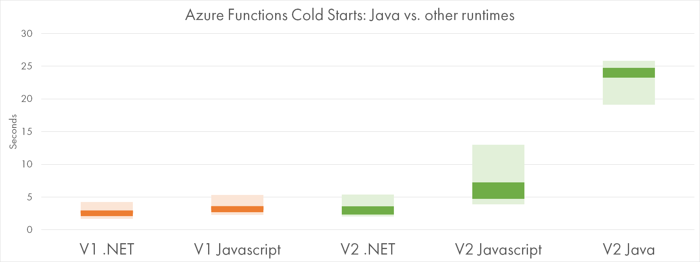
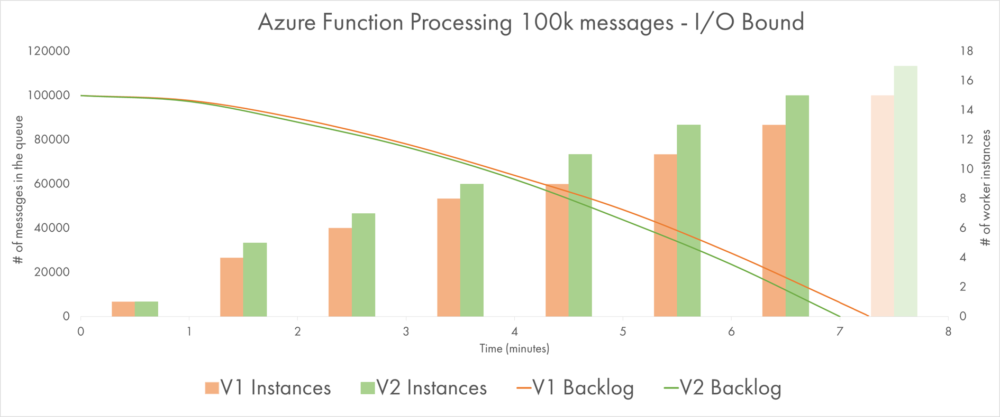
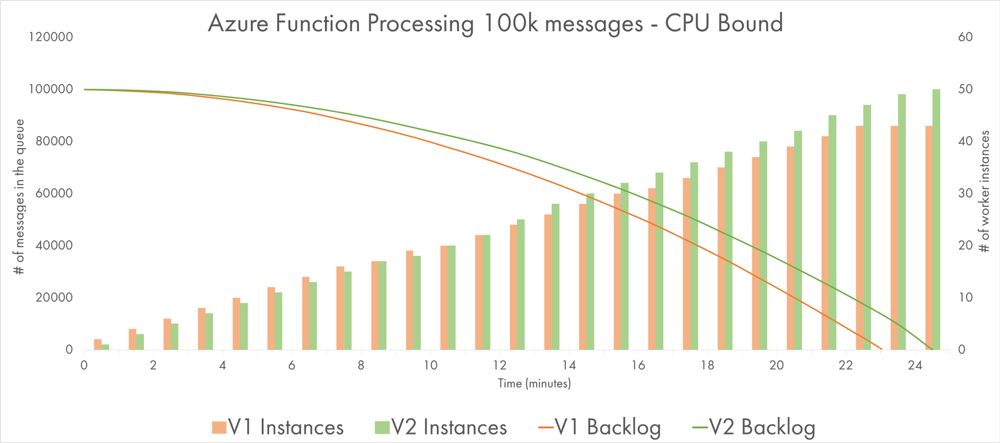
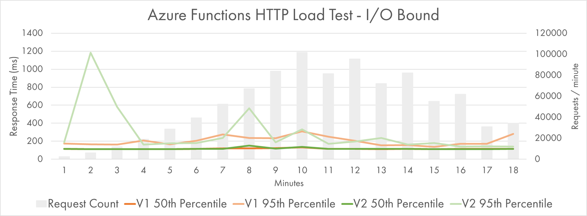

Azure Functions major version 2.0 was released into GA a few days back during Microsoft Ignite. The runtime is now
based on .NET Core and thus is cross-platform and more interoperable. It has a nice extensibility story too.

In theory, .NET Core runtime is more lean and performant.
But last time [I checked back in April](https://mikhail.io/2018/04/azure-functions-cold-starts-in-numbers/),
the preview version of Azure Functions V2 had some serious issues with cold start durations.

I decided to give the new and shiny version another try and ran several benchmarks. **TL;DR**: it's not
perfect just yet.

Cold Starts
-----------

Cold starts happen when a new instance handles its first request, see my other posts:
[one](https://mikhail.io/2018/04/azure-functions-cold-starts-in-numbers/),
[two](https://mikhail.io/2018/05/azure-functions-cold-starts-beyond-first-load/),
[three](https://mikhail.io/2018/08/serverless-cold-start-war/).

### Hello World

The following chart gives a comparison of V1 vs V2 cold starts for the two most popular runtimes:
.NET and Javascript. The dark bar shows the most probable range of values, while the light ones
are possible but less frequent:

Apparently, V2 is slower to start for both runtimes. V2 on .NET is slower by 10% on average and seems 
to have higher variation. V2 on Javascript is massively slower: 2 times on average, and the slowest startup
time goes above 10 seconds.

### Dependencies On Board

The values for the previous chart were calculated for Hello-World type of functions with no extra dependencies.

The chart below shows two more Javascript functions, this time with a decent number of dependencies:

- Referencing 3 NPM packages - 5MB zipped
- Referencing 38 NPM packages - 35 MB zipped

V2 clearly loses on both samples, but V2-V1 difference seems to be consistently within 2.5-3
seconds for any amount of dependencies.

All the functions were deployed with the Run-from-Package method which promises faster startup times.

### Java

Functions V2 come with a new generally-available runtime: Java / JVM. It utilizes the same extensibility
model as Javascript, and thus it seems to be a first-class citizen now.

Cold starts are not first-class though: 

If you are a Java developer, be prepared for 20-25 seconds of initial startup time.

<blockquote class="twitter-tweet" data-conversation="none" data-dnt="true">
That matches some of our internal data. We are looking into it.
&mdash; Paul Batum (@paulbatum) <a href="https://twitter.com/paulbatum/status/1048391445386735616?ref_src=twsrc%5Etfw">October 6, 2018</a></blockquote> 

Queue Processor
---------------

Cold starts are most problematic for synchronous triggers like HTTP requests. They are less relevant
for queue-based workloads, where scale out is of higher importance.

Last year I ran some tests around the ability of Functions to keep up with variable queue load:
[one](https://mikhail.io/2017/08/azure-functions-are-they-really-infinitely-scalable-and-elastic/),
[two](https://mikhail.io/2017/12/azure-functions-get-more-scalable-and-elastic/).

Today I ran two simple tests to compare the scalability of V1 vs. V2 runtimes.

### Pause-and-Go

In my first tests, a lightweight Javascript Function processed messages from an Azure Storage Queue. For
each message, it just pauses for 500 msec and then completes. This is supposed to simulate I/O-bound 
Functions.

I've sent 100,000 messages to the queue and measured how fast they went away. Batch size (degree of parallelism
on each instance) was set to 16.

Two lines show the queue backlogs of two runtimes, while the bars indicate the number of instances working
in parallel at a given minute.

We see that V2 was a bit faster to complete, probably due to more instances provisioned to it at any moment.
The difference is not big though and might be statistically insignificant.

### CPU at Work

Functions in my second experiment are CPU-bound. Each message invokes calculation of a 10-stage Bcrypt
hash. On a very quiet moment, 1 such function call takes about 300-400 ms to complete, consuming 100% CPU 
load on a single core.

Both Functions are precompiled .NET and both are using [Bcrypt.NET](https://github.com/BcryptNet/bcrypt.net).

Batch size (degree of parallelism on each instance) was set to 2 to avoid too much fighting for the same CPU. Yet, 
the average call duration is about 1.5 seconds (3x slower than possible).

The first thing to notice: it's the same number of messages with comparable "sequential" execution time, but 
the total time to complete the job increased 3-fold. That's because the workload is much more demanding to
the resources of application instances, and they struggle to parallelize work more aggressively.

V1 and V2 are again close to each other. One more time, V2 got more instances allocated to it most of the time.
And yet, it seemed to be *consistently* slower and lost about 2.5 minutes on 25 minutes interval (~10%).

HTTP Scalability
----------------

I ran two similar Functions &mdash; I/O-bound "Pause" (~100 ms) and CPU-bound Bcrypt (9 stages, ~150ms) &mdash; under a stress test.
But this time they were triggered by HTTP requests. Then I compared the results for V1 and V2.

### Pause-and-Go

The grey bars on the following charts represent the rate of requests sent and processed within a given minute.

The lines are percentiles of response time: green lines for V2 and orange lines for V1.

Yes, you saw it right, my Azure Functions were processing 100,000 messages per minute at peak. That's a lot of
messages.

Apart from the initial spike at minutes 2 and 3, both versions performed pretty close to each other.

50th percentile is flat close to the theoretic minimum of 100 ms, while the 95th percentile fluctuates a bit, but still
mostly stays quite low. 

Note that the response time is measured from the client perspective, not by looking at the statistics provided by Azure.

### CPU Fanout

How did CPU-heavy workload perform?

To skip ahead, I must say that the response time increased much more significantly, so my sample clients were
not able to generate request rates of 100k per minute. They "only" did about 48k per minute at peak, which still
seems massive to me.

I've run the same test twice: one for Bcrypt implemented in .NET, and one for Javascript.

V2 had a real struggle during the first minute, where response time got terribly slow up to 9 seconds.

Looking at the bold-green 50th percentile, we can see that it's consistently higher than the orange one throughout
the load growth period of the first 10 minutes. V2 seemed to have a harder time to adjust.

This might be explainable by slower growth of instance count:

This difference could be totally random, so let's look at a similar test with Javascript worker. Here is the percentile chart:

The original slowness of the first 3 minutes is still there, but after that time V2 and V1 are on-par.

On-par doesn't sound that great though if you look at the significant edge in the number of allocated instances, in
favor of V2 this time:

Massive 147 instances were crunching Bcrypt hashes in Javascript V2, and that made it a bit faster to respond than V1.

Conclusion
----------

As always, be reluctant to make definite conclusions based on simplistic benchmarks. But I see some trends which might
be true as of today:

- Performance of .NET Functions is comparable across two versions of Functions runtimes;
- V1 still has a clear edge in the cold start time of Javascript Functions;
- V2 is the only option for Java developers, but be prepared to very slow cold starts;
- Scale-out characteristics seem to be independent of the runtime version, although there are blurry signs of
V2 being a bit slower to ramp up or slightly more resource hungry.

I hope this helps in your serverless journey!